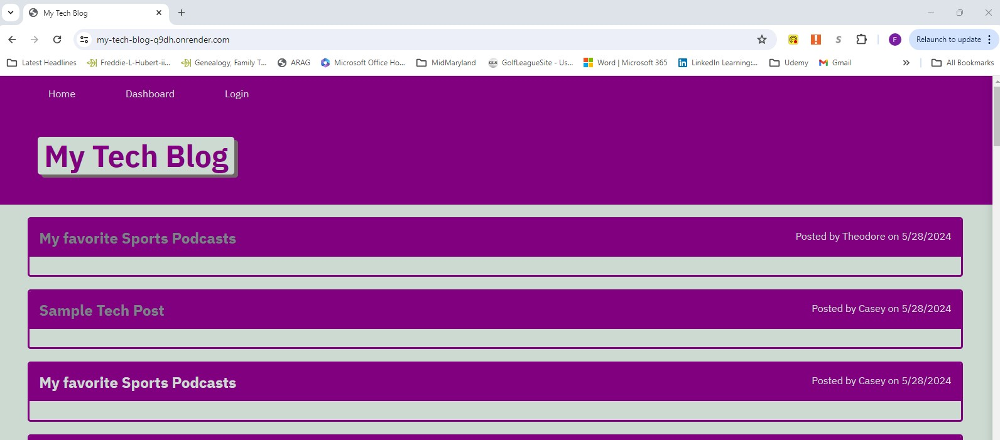
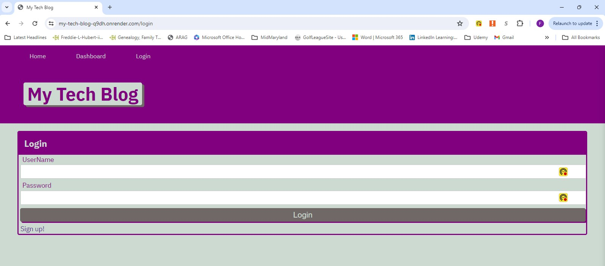
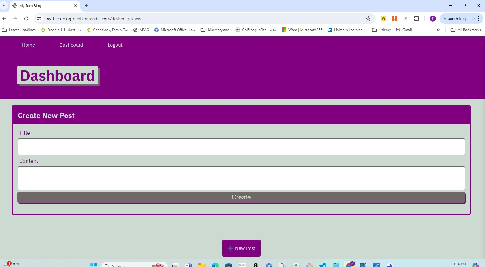
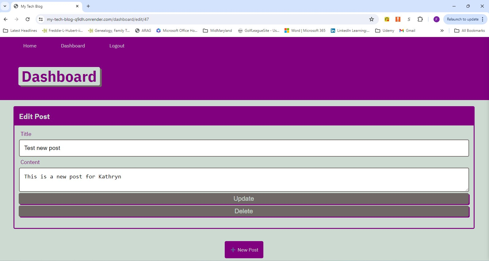

# My Tech Blog

## Description
Task is to build a CMS-style blog website using Model-View-Controller concepts similar to a Wordpress site.  You can publish and comment on blog.  The views use Handelebars and Sequelize as the ORM along with express-session for authentication.

[repo](https://github.com/fhubert1/my-tech-blog)


## Table of Contents
- [Installation](#installation)
- [Configuration](#configuration)
- [Running the Application](#running-the-application)
- [Screenshots](#screenshots)
- [Deployment](#deployment)
- [User Story](#User Story)
- [Acceptance Criteria](#Acceptance Criteria)


## Installation

1. Clone the repository:
    ```sh
    git clone https://github.com/fhubert1/my-tech-blog.git
    cd your-repo
    ```

## Configuration

1. Create a `.env` file in the root directory of your project and add the following environment variables:
    ```env
    PORT=3001
    DB_HOST=your_database_host
    DB_USER=your_database_user
    DB_PASS=your_database_password
    DB_NAME=your_database_name
    ```
2. Ensure your database is set up and accessible with the credentials provided in the `.env` file.

## Running the Application
1. Start the application:
    ```sh
    npm start
    ```

2. Open your browser and navigate to `http://localhost:3001`.

## Screenshots









## Deployment
[My Tech Blog](https://my-tech-blog-q9dh.onrender.com)


## User Story
AS A developer who writes about tech

I WANT a CMS-style blog site
SO THAT I can publish articles, blog posts, and my thoughts and opinions


## Acceptance Criteria
GIVEN a CMS-style blog site

WHEN I visit the site for the first time
THEN I am presented with the homepage, which includes existing blog posts if any have been posted; navigation links for the homepage and the dashboard; and the option to log in

WHEN I click on the homepage option
THEN I am taken to the homepage

WHEN I click on any other links in the navigation
THEN I am prompted to either sign up or sign in

WHEN I choose to sign up
THEN I am prompted to create a username and password

WHEN I click on the sign-up button
THEN my user credentials are saved and I am logged into the site

WHEN I revisit the site at a later time and choose to sign in
THEN I am prompted to enter my username and password

WHEN I am signed in to the site
THEN I see navigation links for the homepage, the dashboard, and the option to log out

WHEN I click on the homepage option in the navigation
THEN I am taken to the homepage and presented with existing blog posts that include the post title and the date created

WHEN I click on an existing blog post
THEN I am presented with the post title, contents, post creator’s username, and date created for that post and have the option to leave a comment

WHEN I enter a comment and click on the submit button while signed in
THEN the comment is saved and the post is updated to display the comment, the comment creator’s username, and the date created

WHEN I click on the dashboard option in the navigation
THEN I am taken to the dashboard and presented with any blog posts I have already created and the option to add a new blog post

WHEN I click on the button to add a new blog post
THEN I am prompted to enter both a title and contents for my blog post

WHEN I click on the button to create a new blog post
THEN the title and contents of my post are saved and I am taken back to an updated dashboard with my new blog post

WHEN I click on one of my existing posts in the dashboard
THEN I am able to delete or update my post and taken back to an updated dashboard

WHEN I click on the logout option in the navigation
THEN I am signed out of the site

WHEN I am idle on the site for more than a set time
THEN I am able to view posts and comments but I am prompted to log in again before I can add, update, or delete posts

